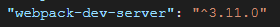
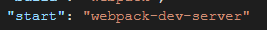
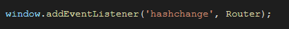
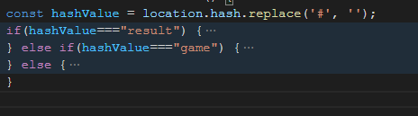

# 개요
주어진 단어가 표시되면 input에 단어를 정해진 시간 내에 입력하여 점수를 획득하는 어플리케이션 개발

# 개발 환경
- webpack 4.43.0
- webpack-cli 3.3.12
- webpack-dev-server 3.11.0
- axios 0.21.0
- css-loader 5.0.1
- html-webpack-plugin 4.5.0
- mini-css-extract-plugin 1.3.1

# 요구사항분석
1. webpack 환경을 구성
    - webpack-dev-server 환경구성
    - start script를 통해서 hot-loading 적용
    - build script를 구성하여 /public 폴더에 빌드한 html, js, css를 export
2. 모든 구현은 vanila javascript(es5, es6 typescript도 가능)로 구현한다.
3. 게임 화면과 완료 화면은 routing을 통하여 이동한다.(라우터 직접구현 - 구현방법은 자율)
4. 단위 테스트 적용
    - 단위 테스트는 테스팅 library를 사용해도 무방함
5. 단어는 서버에 요청하여 받아온다.
    - https://my-json-server.typicode.com/kakaopay-fe/resources/words
    - 응답형식
        time: 단어를 해결하는데 걸리는 시간
        text: 해결해야할 단어
6. 해결전략을 README.md에 작성한다.

# 해결 전략
1. 환경 구성
    - webpack-dev-server 환경 구성   
    
    - package.json 스크립트에 start 명령어 구현   
    
    - package.json 스크립트에 build 명령어 구현   
    

2. 구현
    - javascript, es6를 사용하여 구현

3. routing
    - hash 방식의 routing으로 SPA구현   
    
    - hash의 값에 따라 game, result 화면을 랜더링   
    
        - hash의 값이 #game 또는 #result 이외의 값이 입력되었을 때 game 화면으로 이동
        - hash의 값이 #result 일 때, 점수 와 평균시간이 없을 때 game 화면으로 이동

4. 단위 테스트

5. 단어는 서버에 요청
    - XMLHttpRequest 사용
    - 정상적으로 단어를 응답 받았을 때 게임 시작
    - 에러 발생시 점수 0, 평균시간 0 인 결과 화면이 보여진다.

6. 그외
    - 게임 시작전에 실시간으로 단어를 가져오기 위하여 시작 버튼을 누를시 서버에 있는 단어를 요청한다.
    - 제시된 단어가 표시되면 문제 풀이 시간이 1초부터 시작한다.
    - setInterval 을 이용하여 1초마다 남은시간이 줄어든다.
    - 제한된 시간이 모두 소진되거나, 정답을 맞추면 단어를 가져오기 위해서 [flag] 값을 추가.
    - 입력 박스의 eventlistener 를 중복으로 추가하지 않기 위해서 [once] 값을 추가.
    - 점수와 평균시간을 전달하기 위하여 localStorage 사용.